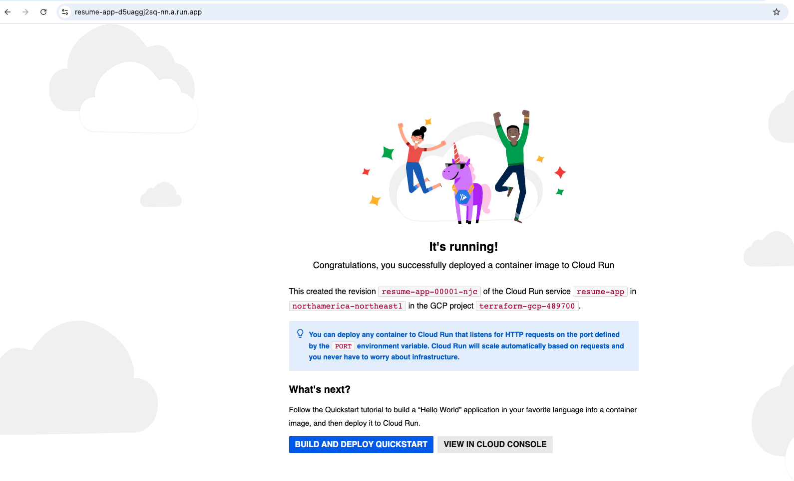

# 🚀 Terraform GCP Production Project

This project demonstrates how to provision a production-style infrastructure on Google Cloud using Terraform.

It follows Infrastructure as Code (IaC) principles and includes modular design, secure configurations, and real cloud services.

---

## 🧱 Architecture

This project provisions the following components:

- Cloud Run (serverless application) ☁️  
- Cloud SQL (MySQL database) 🗄️  
- Secret Manager (secure credential storage) 🔐  
- Service Account (secure access control) 👤  
- Terraform modules (modular and reusable infrastructure) 📦  

---

## ⚙️ What this project demonstrates

- Infrastructure as Code using Terraform  
- Modular Terraform architecture  
- Secure secret management using Secret Manager  
- Cloud Run deployment with containerized app  
- Cloud SQL provisioning and integration  
- IAM role configuration and service account usage  

---

## 🚀 How to run

Initialize Terraform:

```bash
terraform init
terraform plan
terraform apply

```md

